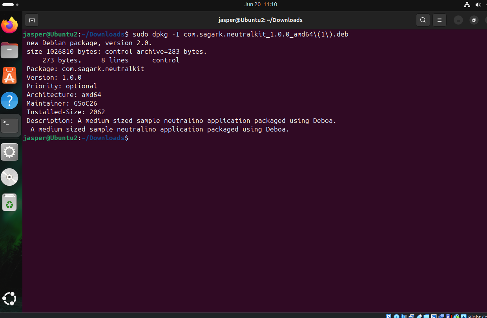
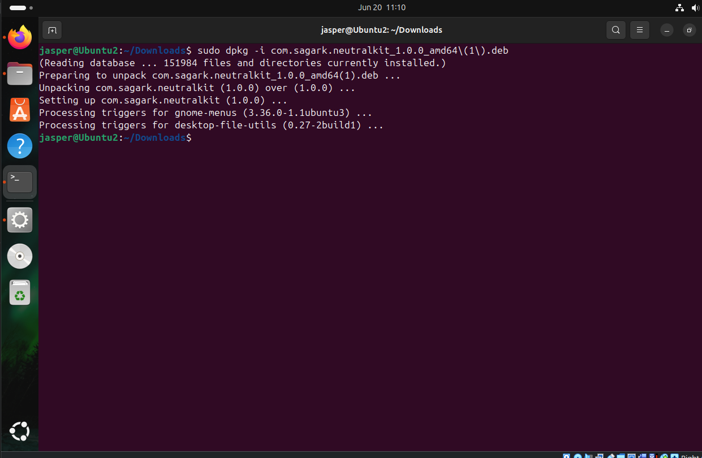
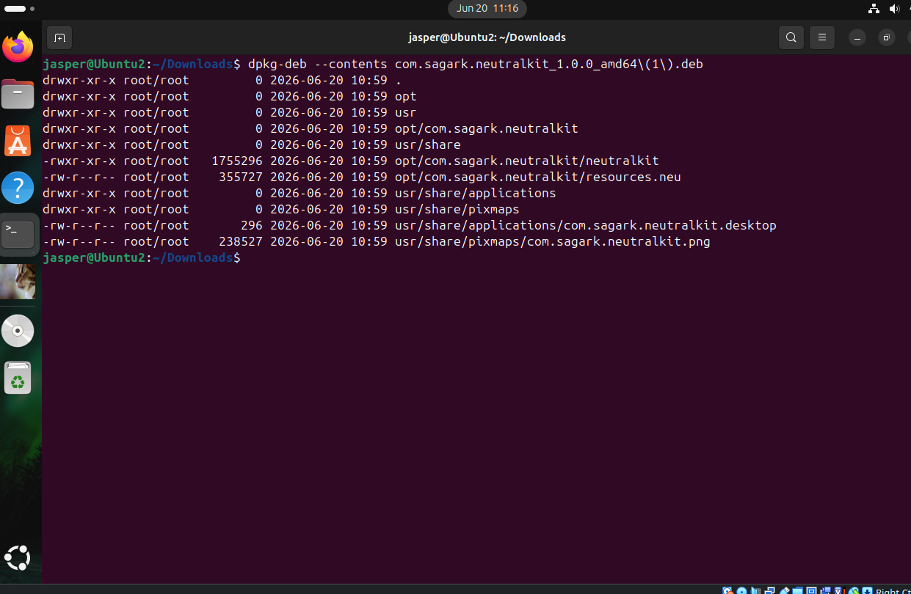
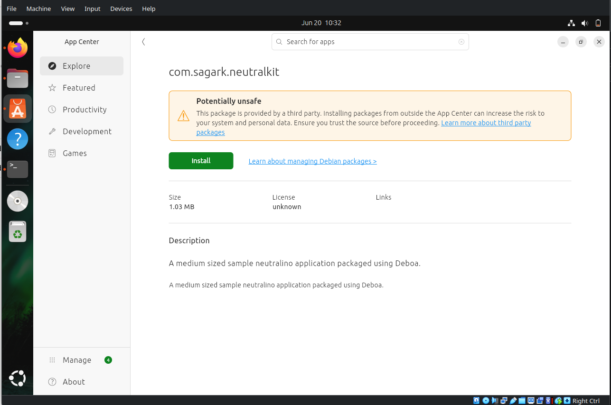
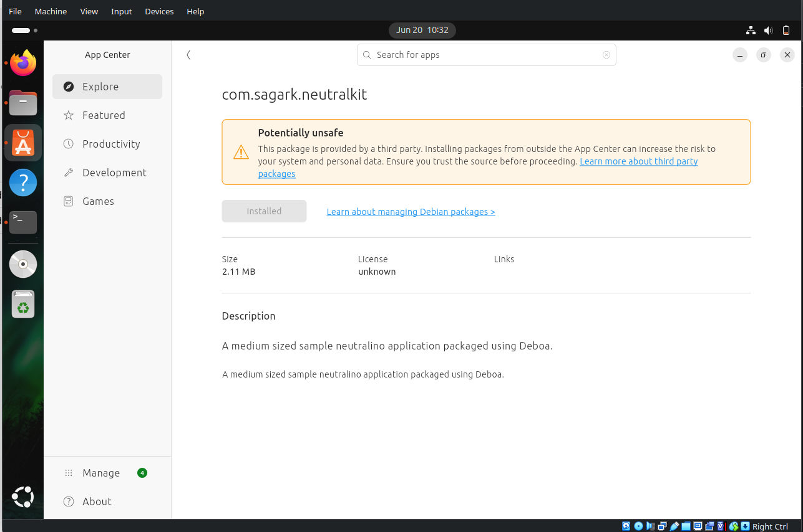
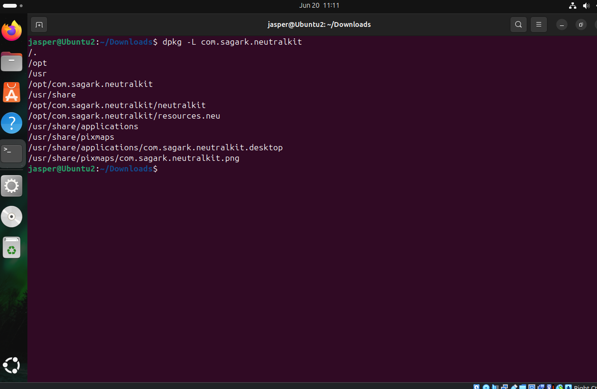
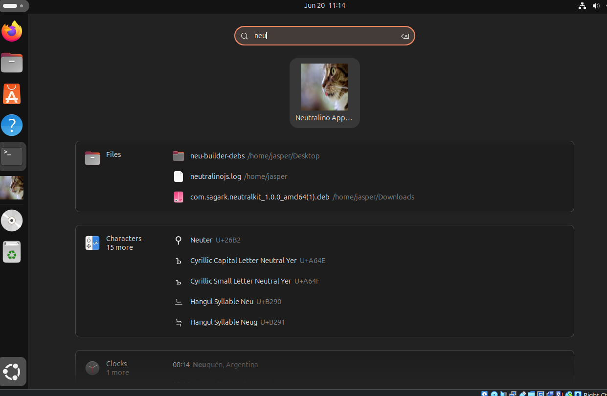
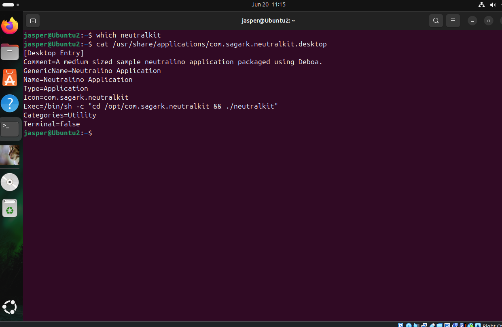
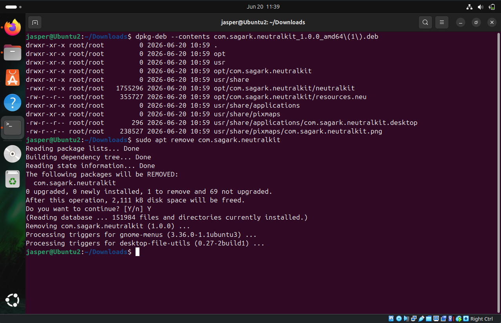

## Packaging logs
```js
    ~/Dev/GSoC-2026-/deb-gen-c/deb-gen-debo/neutralinojs-builder    main !5 ?3  node index.js deb --x64                                                                  ✔ 
neu-builder: INFO Configuration loaded.
neu-builder: INFO Neutralinojs Builder initialized.
neu-builder: INFO Target detected: deb
neu-builder: INFO Starting build pipeline...
neu-builder: INFO Configuration loaded.
neu-builder: INFO Running dependency pre-checks for 'deb'...
neu-builder: INFO Running DEB pre-checks...
neu-builder: INFO Found required tool: dpkg-deb
neu-builder: INFO Dependency pre-checks passed.
neu-builder: INFO Environment pre-checks passed.
neu-builder: INFO Preparing staging directory...
neu-builder: INFO Staging ready at: /home/jasper/Development/GSoC-2026-Devel/deb-gen-comparison/deb-gen-deboa/neutralinojs-builder/.neu-builder-staging
neu-builder: INFO Staging folder prepared successfully.
neu-builder: INFO Loading target: deb
neu-builder: INFO Target loaded: deb
neu-builder: INFO Starting DEB packaging...
neu-builder: INFO DVAL: Validating DEB configuration...
neu-builder: INFO DebValidator: Optional asset 'icon' found: /home/jasper/Development/GSoC-2026-Devel/deb-gen-comparison/deb-gen-deboa/neutralinojs-builder/installerassets/linux/deb/app.png.
neu-builder: INFO DebValidator: DEB configuration validated.
neu-builder: INFO Renamed 'neutralino_x64-linux_x64' -> 'neutralkit'
Validating options...

Creating directory structure in the temporary folder...

Copying maintainer scripts...

Copying source directory...

Creating control file...

App icon saved to /tmp/deboa_temp/data/usr/share/pixmaps/com.sagark.neutralkit.png
Desktop entries file saved to /tmp/deboa_temp/data/usr/share/applications/com.sagark.neutralkit.desktop
Packaging files....

Writing .deb file...

Writing the archive header...

Archive header successfully written

Writing the identifier header for control.tar.gz...

Identifier header for control.tar.gz successfully written

Writing file control.tar.gz...

Writing padding byte for control.tar.gz...

File control.tar.gz successfully written

Writing the identifier header for data.tar.gz...

Identifier header for data.tar.gz successfully written

Writing file data.tar.gz...

File data.tar.gz successfully written

Removing temporary files...

.deb created in 0.28s
neu-builder: INFO Generated package: /home/jasper/Development/GSoC-2026-Devel/deb-gen-comparison/deb-gen-deboa/neutralinojs-builder/dist/linux/com.sagark.neutralkit_1.0.0_amd64.deb
neu-builder: INFO Packaging completed successfully!
neu-builder: INFO Staging directory cleaned up.
    ~/Dev/GSoC-2026-/deb-gen-c/deb-gen-debo/neutralinojs-builder    main !5 ?3                                                                                           ✔ 
```

## Config file
```json
{
  "applicationId": "com.sagark.neutralkit",
  "version": "1.0.0",
  "defaultMode": "window",
  "port": 0,
  "documentRoot": "/resources/",
  "url": "/",
  "enableServer": true,
  "enableNativeAPI": true,
  "tokenSecurity": "one-time",
  "logging": {
    "enabled": true,
    "writeToLogFile": true
  },
  "nativeAllowList": [
    "app.*",
    "os.*",
    "computer.*",
    "filesystem.*",
    "window.*",
    "events.*"
  ],
  "modes": {
    "window": {
      "title": "NeutralKit — GSoC 2026 Demo",
      "width": 1200,
      "height": 750,
      "minWidth": 900,
      "minHeight": 600,
      "center": true,
      "enableInspector": true,
      "exitProcessOnClose": true
    }
  },
  "cli": {
    "binaryName": "neutralino_x64",
    "resourcesPath": "/resources/",
    "extensionsPath": "/extensions/",
    "clientLibrary": "/resources/js/neutralino.js",
    "binaryVersion": "6.5.0",
    "clientVersion": "6.5.0",
    "builder": {
      "windows": {
        "targets": [
          {
            "target": "nsis",
            "arch": ["x64", "ia32"],
            "icon": "./installerassets/windows/nsis/app.ico",
            "sidebarImage": "./installerassets/windows/nsis/sidebar.bmp",
            "headerImage": "./installerassets/windows/nsis/header.bmp",
            "license": "./installerassets/LICENSE.txt",
            "output": "./dist/windows"
          }
        ]
      },

      "linux": {
        "targets": [
          {
            "target": "deb",
            "arch": ["x64", "ia32", "armhf"],
            "icon": "./installerassets/linux/deb/app.png",
            "category": "Utility",
            "output": "./dist/linux",
            "description": "A medium sized sample neutralino application packaged using Deboa.",
            "maintainer": "GSoC26"
          }
        ]
      }
    }
  }
}
```


# Cross-Platform DEB Packaging Validation (Deboa)

This document demonstrates the validation process for the cross-platform DEB packaging implementation using **Deboa**. The generated package was installed and tested on a fresh Ubuntu virtual machine to verify package installation, desktop integration, application launch, and package structure.

## 1. Package Metadata

The generated package metadata was inspected to verify the package name, version, architecture, maintainer information, and description.



---

## 2. Package Control Information

The package control information was inspected using `dpkg -i` and package metadata validation tools.



---

## 3. Package Contents

The package contents were inspected to verify that all required files were included in the generated DEB package.



---

## 4. Application Installation

The generated package was successfully installed and appeared within Ubuntu's application management interface.



After installation, the application was correctly registered with the operating system.



---

## 5. Installed Files Validation

The installed file locations were verified using `dpkg -L`.



This confirms that the application files, launcher, desktop entry, and icon assets were installed correctly.

---

## 6. Desktop Integration

The application was successfully integrated into the Ubuntu desktop environment and appeared in search results. The application could also be pinned to the dock and launched normally.



---

## 7. Desktop Entry Verification

The generated desktop entry was inspected after installation to verify launcher configuration and desktop integration.



---

## 8. Uninstalling



# Conclusion

The cross-platform DEB packaging implementation using **Deboa** was successfully validated on Ubuntu. The generated package installs correctly, registers desktop integration assets, appears in the application launcher, supports dock integration, and exposes the expected package metadata and filesystem layout. These results demonstrate that a pure JavaScript DEB generation approach can produce installable and functional Debian packages without relying on native Debian packaging tools, making it a viable option for cross-platform package generation.
