# Native DEB Packaging Validation Walkthrough

This document demonstrates the validation process for the native DEB packaging implementation using `dpkg-deb`. The generated package was installed and tested on a fresh Ubuntu virtual machine to verify package installation, desktop integration, application launch, and package lifecycle operations.


## Packaging output
```sh
    ~/Dev/GSoC-2026-/deb-gen-c/deb-gen-dp/neutralinojs-builder    main !6 ?4  node index.js deb --x64                                                                    ✔ 
neu-builder: INFO Configuration loaded.
neu-builder: INFO Neutralinojs Builder initialized.
neu-builder: INFO Target detected: deb
neu-builder: INFO Starting build pipeline...
neu-builder: INFO Configuration loaded.
neu-builder: INFO Running dependency pre-checks for 'deb'...
neu-builder: INFO Running DEB pre-checks...
neu-builder: INFO Found required tool: dpkg-deb
neu-builder: INFO Dependency pre-checks passed.
{
  hostPlatform: 'linux',
  targetPlatform: 'linux',
  target: 'deb',
  arch: 'x64',
  buildType: 'standard',
  assets: {
    icon: './installerassets/linux/deb/app.png',
    license: null,
    sidebarImage: null,
    headerImage: null,
    background: null
  },
  metadata: {
    applicationId: 'com.sagarK.neutralkit',
    applicationName: 'Neutralino Application',
    resolvedBinaryName: null,
    version: '1.0.0',
    maintainer: 'GSoC26',
    category: 'Utility',
    description: 'A medium sized sample neutralino application packaged using dpkg.'
  },
  paths: { output: './dist/linux' },
  neuBuildFlags: []
}
neu-builder: INFO Environment pre-checks passed.
neu-builder: INFO Preparing staging directory...
neu-builder: INFO Standard build detected. Copying application artifacts...
neu-builder: INFO Staging ready at: /home/jasper/Development/GSoC-2026-Devel/deb-gen-comparison/deb-gen-dpkg/neutralinojs-builder/.neu-builder-staging
neu-builder: INFO Staging folder prepared successfully.
neu-builder: INFO Loading target: deb
neu-builder: INFO Target loaded: deb
neu-builder: INFO Starting DEB packaging...
neu-builder: INFO Build: Validating assets...
neu-builder: INFO DVAL: Validating DEB configuration...
neu-builder: INFO DebValidator: Optional asset 'icon' found: /home/jasper/Development/GSoC-2026-Devel/deb-gen-comparison/deb-gen-dpkg/neutralinojs-builder/installerassets/linux/deb/app.png.
neu-builder: INFO DebValidator: DEB configuration validated.
neu-builder: INFO Build: Assets validated.
neu-builder: INFO Build: Preparing Debian package layout...
neu-builder: INFO Renamed 'neutralino_x64-linux_x64' -> 'neutralkit'
neu-builder: INFO StagingLayout: Prepared Debian layout.
neu-builder: INFO StagingLayout: Validated Debian layout.
neu-builder: INFO Build: Debian layout prepared.
neu-builder: INFO DesktopDen: Generating desktop entry
neu-builder: INFO DesktopDen: Generated desktop entry
neu-builder: INFO Build: Desktop entry generated.
neu-builder: INFO DesktopDen: Generating install icon
neu-builder: INFO DesktopDen: Generated icon
neu-builder: INFO Build: Icon installed.
neu-builder: INFO LauncherGen: Generating launcher
neu-builder: INFO LauncherGen: Generated launcher
neu-builder: INFO Build: Launcher generated.
neu-builder: INFO Build: Generating control file...
neu-builder: INFO ControlGen: Generating control
neu-builder: INFO ControlGen: Generated control
neu-builder: INFO Build: Control file generated.
neu-builder: INFO Build: Building DEB package...
neu-builder: INFO Build: Generated package: dist/linux/com.sagarK.neutralkit-1.0.0.deb
neu-builder: INFO Packaging completed successfully!
neu-builder: INFO Staging directory cleaned up.
    ~/Dev/GSoC-2026-/deb-gen-c/deb-gen-dp/neutralinojs-builder    main !6 ?4                                                                                             ✔ 
```

## Config file
```json
{
  "applicationId": "com.sagarK.neutralkit",
  "version": "1.0.0",
  "defaultMode": "window",
  "port": 0,
  "documentRoot": "/resources/",
  "url": "/",
  "enableServer": true,
  "enableNativeAPI": true,
  "tokenSecurity": "one-time",
  "logging": {
    "enabled": true,
    "writeToLogFile": true
  },
  "nativeAllowList": [
    "app.*",
    "os.*",
    "computer.*",
    "filesystem.*",
    "window.*",
    "events.*"
  ],
  "modes": {
    "window": {
      "title": "NeutralKit — GSoC 2026 Demo",
      "width": 1200,
      "height": 750,
      "minWidth": 900,
      "minHeight": 600,
      "center": true,
      "enableInspector": true,
      "exitProcessOnClose": true
    }
  },
  "cli": {
    "binaryName": "neutralino_x64",
    "resourcesPath": "/resources/",
    "extensionsPath": "/extensions/",
    "clientLibrary": "/resources/js/neutralino.js",
    "binaryVersion": "6.5.0",
    "clientVersion": "6.5.0",
    "builder": {
      "windows": {
        "targets": [
          {
            "target": "nsis",
            "arch": ["x64", "ia32"],
            "icon": "./installerassets/windows/nsis/app.ico",
            "sidebarImage": "./installerassets/windows/nsis/sidebar.bmp",
            "headerImage": "./installerassets/windows/nsis/header.bmp",
            "license": "./installerassets/LICENSE.txt",
            "output": "./dist/windows"
          }
        ]
      },

      "linux": {
        "targets": [
          {
            "target": "deb",
            "arch": ["x64", "ia32", "armhf"],
            "icon": "./installerassets/linux/deb/app.png",
            "category": "Utility",
            "output": "./dist/linux",
            "description": "A medium sized sample neutralino application packaged using dpkg.",
            "maintainer": "GSoC26"
          }
        ]
      }
    }
  }
}
```

## 1. Package Metadata

The generated package metadata was inspected to verify package information such as name, version, architecture, maintainer, and description.

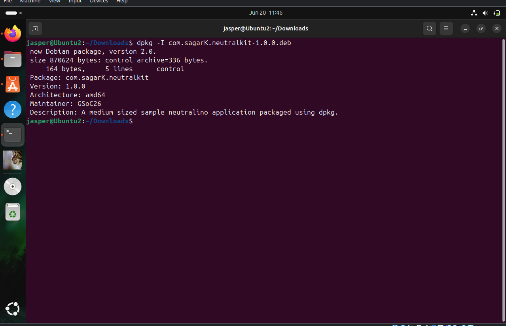

---

## 2. Package Installation

The generated DEB package was installed successfully on Ubuntu using the Debian package manager.

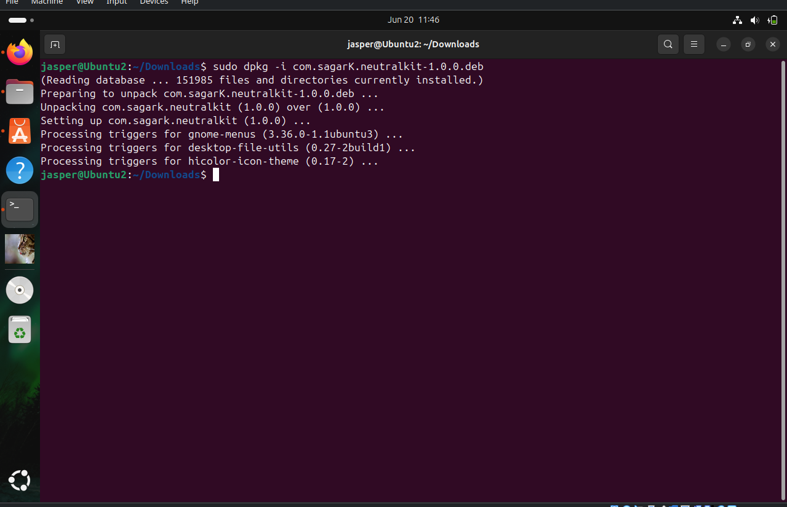

---

## 3. Package Contents

The package contents were inspected to verify that all required files were bundled correctly inside the generated DEB archive.

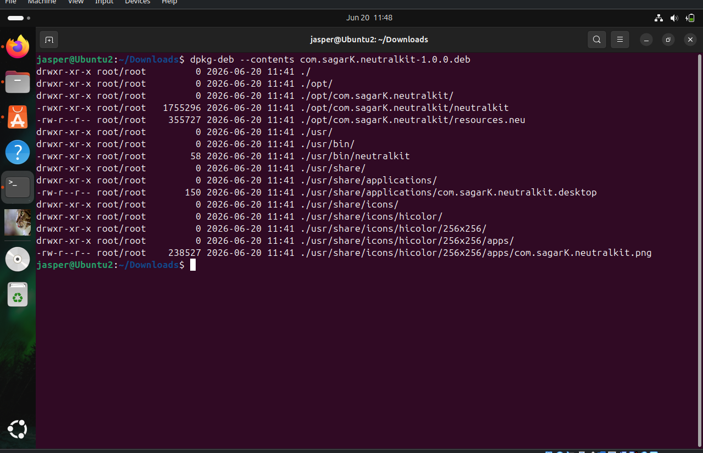

---

## 4. Installed Files Validation

The installed file locations were verified using `dpkg -L`.

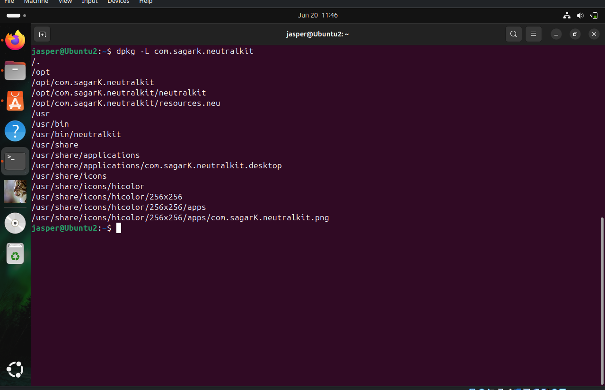

This confirms that the application binary, launcher, desktop entry, icon, and supporting files were installed to the expected locations.

---

## 5. Application Registration

After installation, the application appeared correctly within Ubuntu's application management interface.

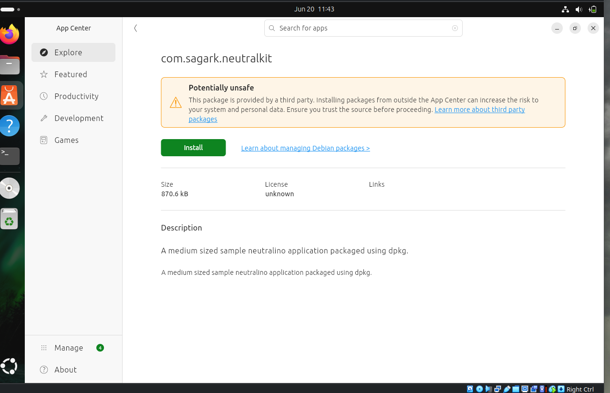

The package was also visible as an installed application after installation completed.

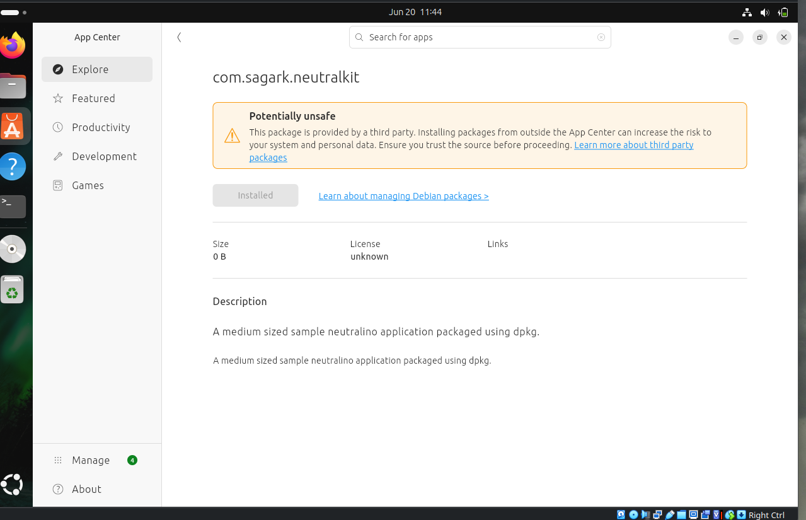

---

## 6. Launcher Verification

The installed launcher was verified using the `which` command to ensure that the executable was available through the system PATH.

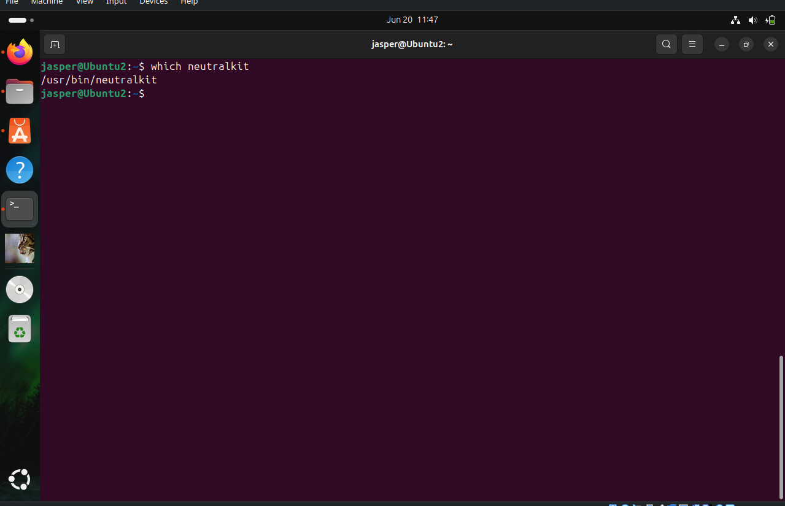

---

## 7. Application Launch from Terminal

The application was launched successfully from the terminal using the installed launcher.

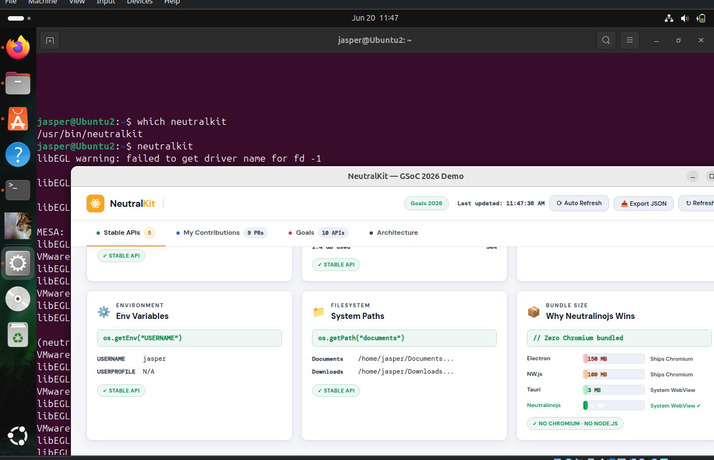

---

## 8. Running Application Validation

The application launched correctly and operated as expected after installation.

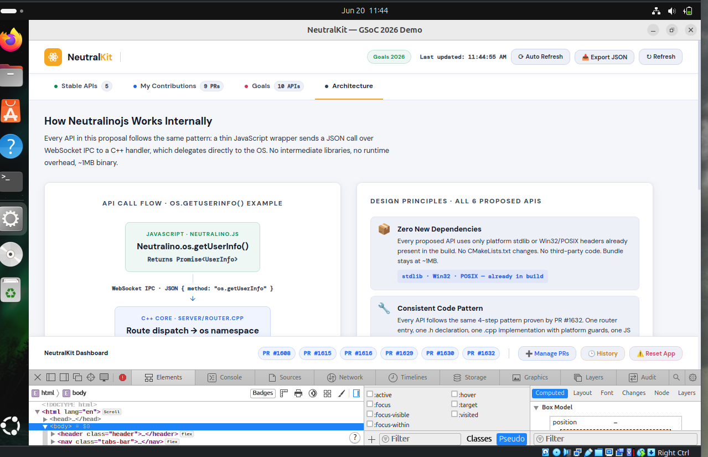

---

## 9. Desktop Integration

The application was successfully integrated into the Ubuntu desktop environment. It appeared in system search and could be pinned to the dock for quick access.

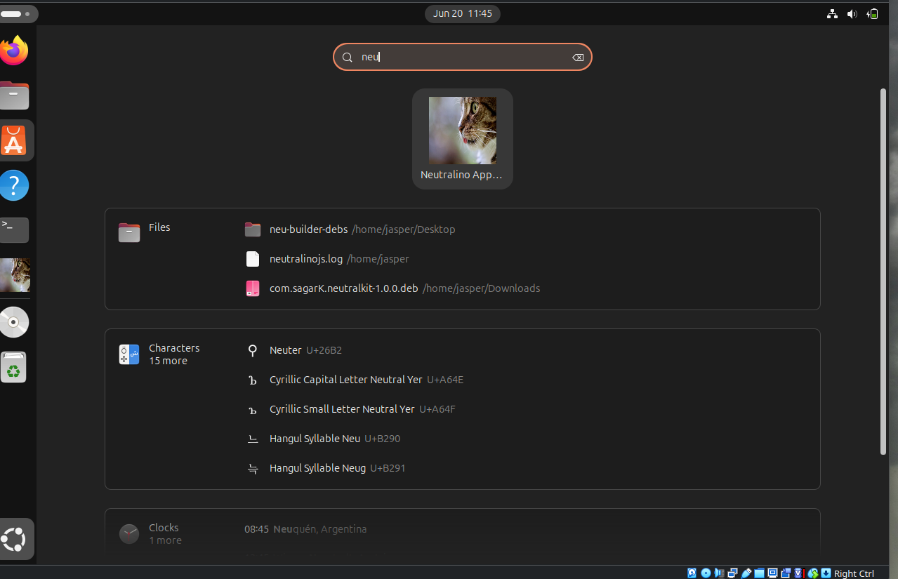

---

## 10. Desktop Entry Validation

The generated desktop entry was inspected after installation to verify launcher configuration and desktop integration settings.

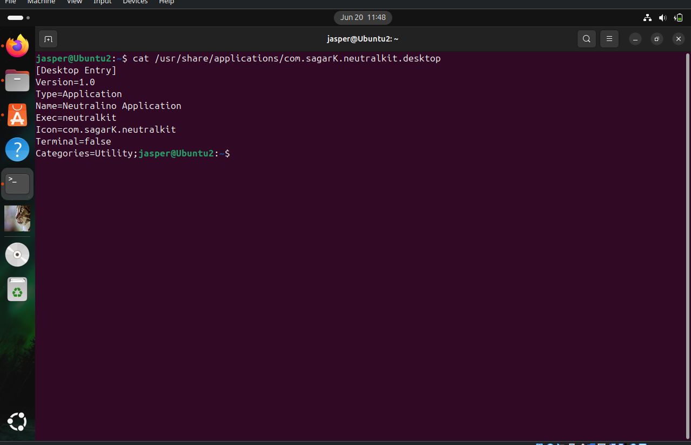

---

## 11. Package Removal

The package was successfully removed using `dpkg`, confirming that the uninstall workflow functions correctly.

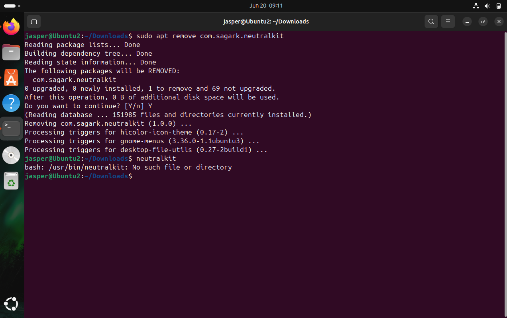

---

# Conclusion

The native DEB packaging implementation using `dpkg-deb` was successfully validated on Ubuntu. The generated package installs correctly, registers desktop integration assets, appears in the application launcher, launches successfully from both the terminal and graphical interface, supports dock integration, and uninstalls cleanly.

These results establish a reliable baseline for comparison against the cross-platform DEB generation implementation using Deboa and confirm that the native packaging workflow is functioning as expected.
